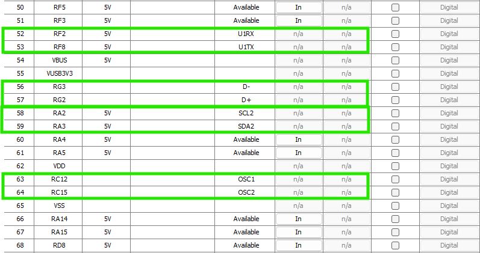

# USB - HID communication

This application presents the way to build an application built on USB HID communication between a PIC microcontroller and a Software application that runs on a Windows PC.

# Hardware Device and  Firmware

The firmware component is implemented on a PIC32MX type of microcontroller 

  

The main features of this board are listed in the image below

  

## Harmony configuration

MCC Harmony was used to configure the projects including its structure and main peripheral components and even the USB part.

The main component configured for this project are presented next.

### Basic configurations
Basic configuration includes the project setup, clock configuration and pin configuration

Clock configuration is a very important job in order to have a functional USB connection. Otherwise, the operating system used on the host device will not recognize the device.

In our case, we have an 8MHz clock connected on the OSC1 pin. This clock shall be enabled. USB PLL block is to be configured next, so the output frequency will be 48 MHz.

**Clock Configuration** utility will guide you throughout the process (see the image below).

 

On `Harmony Core Service` block, make sure that Application 0 configuration is enabled, to ensure the proper structure of your project.

 

In next picture there are four groups o pins marked:
1. UART1 RX and TX pins used for debugging purposes. `UART1` Harmony block is followed by a `console block` so the microcontroller can print messages to terminals connected to this serial interface.
2. `D-` and `D+` pins that are directly connected to the USB plug - data lines.
3. `SCL2` and `SDA2` for I2C communication. This will be used to communicate with a flash device that is present our development board.
4. `OSC1` and `OSC2` are the oscillator inputs. Those two are important for this configuration because there is an 8MHz oscillator connected to them. This external oscillator is providing the clock source for the USB to operate.

 

Next, there are some buttons and LEDs connected to the board, that are used to signal the status of the usb connection and for other test purposes.


 

### USB device configuration 
Here should included all the USB related blocks that will generate all the required USB functionalities.

See the pictures below to see what the block are and how their parameters should look like.

 

To import those blocks at once, it is enough to select `HID Function Driver` from `Device Resources > Harmony > USB > Device Stack`, and the MCC Harmony will ask for the rest of them. 

>**NOTE!** \
>This project is not using **FreeRTOS**. Pay attention when Harmony offers to activate **FreeRTOS** and refuse it.

Configure **USB Device Layer** as the figure below suggests.

 

For the **HID Function Driver** block set *Report Type* to **Custom**.

 

After generating the code configured using these block and settings, among others, there will be a file called `usb_device_init_data.c` that contains the resulting device descriptor. This descriptor will be presented to the host (computer) where our device is connected to.

"The part of the device descriptor that is related to HID functionality is presented below:

```c
const uint8_t fullSpeedConfigurationDescriptor[]=
{
    /* Configuration Descriptor */

    0x09,                                                   // Size of this descriptor in bytes
    USB_DESCRIPTOR_CONFIGURATION,                           // Descriptor Type
    USB_DEVICE_16bitTo8bitArrange(41),                      //(41 Bytes)Size of the Configuration descriptor
    1,                                                      // Number of interfaces in this configuration
    0x01,                                                   // Index value of this configuration
    0x00,                                                   // Configuration string index
    USB_ATTRIBUTE_DEFAULT | USB_ATTRIBUTE_SELF_POWERED, // Attributes
    50,                                                 // Maximum power consumption (mA) /2

	/* Interface Descriptor */

    0x09,                               // Size of this descriptor in bytes
    USB_DESCRIPTOR_INTERFACE,           // Descriptor Type is Interface descriptor
    0,                                  // Interface Number
    0x00,                                  // Alternate Setting Number
    0x02,                                  // Number of endpoints in this interface
    USB_HID_CLASS_CODE,                 // Class code
    USB_HID_SUBCLASS_CODE_NO_SUBCLASS , // Subclass code
    USB_HID_PROTOCOL_CODE_NONE,         // No Protocol
    0x00,                                  // Interface string index

    /* HID Class-Specific Descriptor */

    0x09,                           // Size of this descriptor in bytes
    USB_HID_DESCRIPTOR_TYPES_HID,   // HID descriptor type
    0x11,0x01,                      // HID Spec Release Number in BCD format (1.11)
    0x00,                           // Country Code (0x00 for Not supported)
    1,                              // Number of class descriptors
    USB_HID_DESCRIPTOR_TYPES_REPORT,// Report descriptor type
    USB_DEVICE_16bitTo8bitArrange(sizeof(hid_rpt0)),   // Size of the report descriptor

    /* Endpoint Descriptor */

    0x07,                           // Size of this descriptor in bytes
    USB_DESCRIPTOR_ENDPOINT,        // Endpoint Descriptor
    1 | USB_EP_DIRECTION_IN,    // EndpointAddress ( EP1 IN )
    USB_TRANSFER_TYPE_INTERRUPT,    // Attributes
    0x40,0x00,                      // Size
    0x01,                           // Interval

    /* Endpoint Descriptor */

    0x07,                           // Size of this descriptor in bytes
    USB_DESCRIPTOR_ENDPOINT,        // Endpoint Descriptor
    1 | USB_EP_DIRECTION_OUT,   // EndpointAddress ( EP1 OUT )
    USB_TRANSFER_TYPE_INTERRUPT,    // Attributes
    0x40,0x00,                      // size
    0x01,                           // Interval
};
```
When running the test script, this device descriptor appears like in the image below, where HID related part is inside the green rectangle:

 


## Basic firmware components

### USB-HID

To implement the USB-HID functionality, behind base configuration made using MCC, there should be some code blocks added in order to have an working USB device.

First of all, there is a callback function needed to handle USB events.
```c
void APP_USBDeviceEventHandler(
    USB_DEVICE_EVENT event, 
    void * eventData, 
    uintptr_t context
){
    switch(event){
        case USB_DEVICE_EVENT_RESET:
        case USB_DEVICE_EVENT_DECONFIGURED:

            /* Host has de configured the device or a bus reset has happened.
             * Device layer is going to de-initialize all function drivers.
             * Hence close handles to all function drivers (Only if they are
             * opened previously. */

            LD4_Clear(); 
            appData.deviceConfigured = false;
            appData.state = APP_STATE_WAIT_FOR_CONFIGURATION;
            break;

        case USB_DEVICE_EVENT_CONFIGURED:
            LD4_Set(); 
            /* Set the flag indicating device is configured. */
            appData.deviceConfigured = true;

            /* Save the other details for later use. */
            appData.configurationValue = ((USB_DEVICE_EVENT_DATA_CONFIGURED*)eventData)->configurationValue;

            /* Register application HID event handler */
            USB_DEVICE_HID_EventHandlerSet(USB_DEVICE_HID_INDEX_0, APP_USBDeviceHIDEventHandler, (uintptr_t)&appData);


            break;

        case USB_DEVICE_EVENT_SUSPENDED:
		
			LD4_Clear();
            break;

        case USB_DEVICE_EVENT_POWER_DETECTED:
            /* VBUS was detected. We can attach the device */
            USB_DEVICE_Attach (appData.usbDevHandle);
            break;

        case USB_DEVICE_EVENT_POWER_REMOVED:
            LD4_Clear(); 
            /* VBUS is not available */
            USB_DEVICE_Detach(appData.usbDevHandle);
            break;

        /* These events are not used in this demo */
        case USB_DEVICE_EVENT_RESUMED:
            if(appData.deviceConfigured == true){
                LD4_Set();
            }
            break;
        case USB_DEVICE_EVENT_ERROR:
        default:
            break;
    }
}

```

Another callback function handles HID specific events

```c
USB_DEVICE_HID_EVENT_RESPONSE APP_USBDeviceHIDEventHandler
(
    USB_DEVICE_HID_INDEX iHID,
    USB_DEVICE_HID_EVENT event,
    void * eventData,
    uintptr_t userData
){
    USB_DEVICE_HID_EVENT_DATA_REPORT_SENT * reportSent;
    USB_DEVICE_HID_EVENT_DATA_REPORT_RECEIVED * reportReceived;

    /* Check type of event */
    switch (event){
        case USB_DEVICE_HID_EVENT_REPORT_SENT:
            /* The eventData parameter will be USB_DEVICE_HID_EVENT_REPORT_SENT
             * pointer type containing details about the report that was
             * sent. */
            reportSent = (USB_DEVICE_HID_EVENT_DATA_REPORT_SENT *) eventData;
            if(reportSent->handle == appData.txTransferHandle ){
                // Transfer progressed.
                appData.hidDataTransmitted = true;
            }
            
            break;

        case USB_DEVICE_HID_EVENT_REPORT_RECEIVED:
            /* The eventData parameter will be USB_DEVICE_HID_EVENT_REPORT_RECEIVED
             * pointer type containing details about the report that was
             * received. */

            reportReceived = (USB_DEVICE_HID_EVENT_DATA_REPORT_RECEIVED *) eventData;
            if(reportReceived->handle == appData.rxTransferHandle ){
                // Transfer progressed.
                appData.hidDataReceived = true;
            }
          
            break;

        case USB_DEVICE_HID_EVENT_SET_IDLE:
            /* For now we just accept this request as is. We acknowledge
             * this request using the USB_DEVICE_HID_ControlStatus()
             * function with a USB_DEVICE_CONTROL_STATUS_OK flag */

            USB_DEVICE_ControlStatus(appData.usbDevHandle, USB_DEVICE_CONTROL_STATUS_OK);

            /* Save Idle rate received from Host */
            appData.idleRate = ((USB_DEVICE_HID_EVENT_DATA_SET_IDLE*)eventData)->duration;
            break;

        case USB_DEVICE_HID_EVENT_GET_IDLE:
            SYS_CONSOLE_PRINT("USB_DEVICE_HID_EVENT_GET_IDLE \r\n");
            /* Host is requesting for Idle rate. Now send the Idle rate */
            USB_DEVICE_ControlSend(appData.usbDevHandle, & (appData.idleRate),1);

            break;
        default:
            // Nothing to do.
            break;
    }
    return USB_DEVICE_HID_EVENT_RESPONSE_NONE;
}
```

Those callback functions are registerd to the corresponding USB objects during initial device configuration secquence, as shown below:

```c
switch(appData.state) {
    case APP_STATE_INIT:

        /* Open the device layer */
        appData.usbDevHandle = USB_DEVICE_Open( USB_DEVICE_INDEX_0, DRV_IO_INTENT_READWRITE );

        if(appData.usbDevHandle != USB_DEVICE_HANDLE_INVALID){
            /* Register a callback with device layer to get event notification (for end point 0) */
            USB_DEVICE_EventHandlerSet(appData.usbDevHandle, APP_USBDeviceEventHandler, 0);
            appData.state = APP_STATE_WAIT_FOR_CONFIGURATION;
        }else{
            /* The Device Layer is not ready to be opened. We should try
                * again later. */
        }

        break;

    case APP_STATE_WAIT_FOR_CONFIGURATION:

        if(appData.deviceConfigured == true){
            /* Device is ready to run the main task */
            appData.hidDataReceived = false;
            appData.hidDataTransmitted = true;
            appData.state = APP_STATE_MAIN_TASK;

            /* Place a new read request. */
            USB_DEVICE_HID_ReportReceive (USB_DEVICE_HID_INDEX_0,
                    &appData.rxTransferHandle, appData.receiveDataBuffer, 64);
        }
        break;
        ...
}

```
# Software
## Basic Software components

### Test Script for USB-HID functionality

THe following script is used to test the USB-HID communication:

```python
import usb.core
import usb.util
from time import sleep

VENDOR_ID = 0x04D8
PRODUCT_ID = 0x003F
dev=usb.core.find(idVendor=VENDOR_ID, idProduct=PRODUCT_ID)

if dev is None:
    print('Device not found')
    exit()
print(f"Device descriptor:\n{dev}")

dev.set_configuration() #set first available configuration (this device has only one)

endpoint_in = dev[0][(0,0)][0]
endpoint_out = dev[0][(0,0)][1]
while True:
    send_list=[0]*64 #list of 64 elements
    try:
        send_list[0]=0x80 #as requested by the implemented protocol
        res=dev.write(endpoint_out.bEndpointAddress, send_list, 10)
    except Exception as e:
        print(e)

    try:
        send_list[0]=0x81 #as requested by the implemented protocol
        res=dev.write(endpoint_out.bEndpointAddress, send_list, 10)
    except Exception as e:
        print(e)

    try:
        res=(dev.read(endpoint_in.bEndpointAddress, 64, timeout=10))[0:2].tobytes()
        print(res)
    except Exception as e:
        print(e)

    sleep(0.1)
```

> NOTE! 
>
>Further development will include a graphical interface that could be used to configure and execute I2C requests.
>
> 

## GUI - User instructions